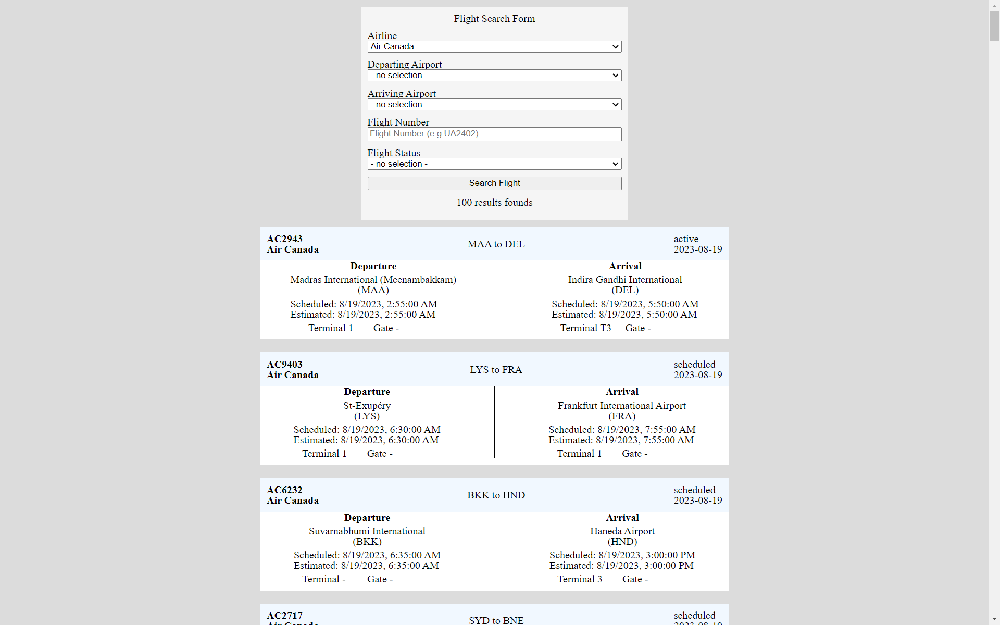

# flight-app

## About

This is a simple flight search frontend app built using React and Redux. All flight, airport, and airline data is queried for free from [aviationstack](https://aviationstack.com/).

The app consists of a flight form with optional parameters such as airline, departure airport, arrival airport, flight number, and flight status. At least one parameter must be filled to be able to search flights, and may take a few minutes to search.

Flight information includes departure and arrival airports, departure and arrival times, flight date, flight status, airline, terminals, and gates.

## How to install and use

This app uses [node package manager](https://www.npmjs.com/)

1. Git clone or download this repository.
2. cd or open the `/frontend` folder in terminal.
3. run `npm install` to install all node modules.
4. Signup for a free api key at [aviationstack](https://aviationstack.com/).
5. In the `/frontend` folder create a `.env` file and 
6. Add this line to the `.env` file `REACT_APP_AVIATION_API_KEY=<YOUR_API_KEY_HERE>` (substitute `<YOUR_API_KEY_HERE>` with your aviationstack api key)
7. In the `/frontend` folder run `npm start` and open up localhost:3000 on your browser.
8. Play around with the app 🙂. 

(note that the `[search flights]` button is disabled if nothing is input, and while waiting for search results).

## Example Screenshot

## Problems I faced

Figuring out how to make a proper fetch request to the aviationstack api using HTTP and not HTTPS (because only paid plans can make HTTPS requests), while React was auto upgrading from HTTP to HTTPS.

- Fixed by setting a `"proxy": "http://api.aviationstack.com/v1"` key-value pair in the package.json.

Limitations of the free aviationstack key (e.g can't query by flight date).

## My planning and building process

1. Researching the aviationstack api documentation and experimenting with PostMan
2. Planning possible components and information to store.
3. Setting up React and Redux
4. Building the Redux store, starting with the airlines and airports reducer (since those options need to be fetched from the API and displayed first)
5. Building out the flight search form and debugging the fetch requests.
6. Adding the flight reducer to query and store flight information.
7. Building out the flight displays and flight item components. Mapping each flight info into a FlightItem.
8. Adding basic error handling and a waiting message (so the client knows to wait for search results)
9. Styling is done throughout the process, and each major feature has basic styling done before moving onto the next.
10. Testing the app and debugging any issues throughout as well.

## My thoughts

I initially wanted to build this project with Next.js and TypeScript because I have recently been learning those along with Django/Flask. But I chose to use the create-react-app and JavaScript since I was more comfortable with that and setting it up.

The search form is missing filtering by live coordinates (latitude and longitude). I was planning on using a geomap selector (possibly with google maps) to easily select places around the globe, but it would've taken more time to implement. I also wanted to filter within a nearby range to the input coordinates, since matching exact inputs could have errors. Also most, if not all, the returned flight data had `null` live data which means this filter wouldn't work (may be due to free limits).

If I had more time for styling, I definitely would've paginated large search results, and formatted things a bit more nicely and readable.

I also would've liked to spend more time with error handling, and adding some frontend testing.
